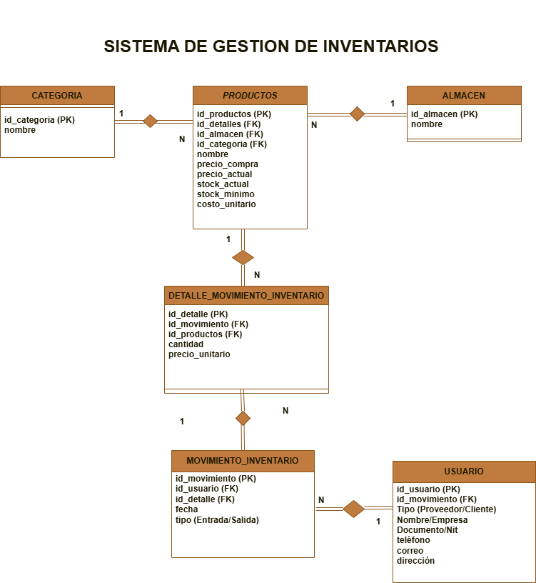

# TrackStock — Sistema de Gestión de Inventarios

Proyecto integrador de Nuevas Tecnologías · CESDE · 2026-1

---

## Descripción del proyecto

**TrackStock** es un sistema web de gestión de inventarios desarrollado como proyecto final universitario. Permite a una empresa u organización administrar sus productos de forma sencilla y profesional: registrar entradas y salidas de mercancía, controlar el stock disponible, organizar productos por categoría y almacén, y llevar un historial de movimientos asociado a clientes o proveedores.

El enfoque del proyecto es practicar la integración completa entre frontend, backend y capa de datos, siguiendo una arquitectura web clásica con tecnologías Java.

---

## Funcionalidades principales

- Registrar productos con nombre, precios, stock actual, stock mínimo y categoría
- Agregar, editar y eliminar productos mediante formularios web validados
- Filtrar productos por categoría o almacén
- Registrar movimientos de inventario (entradas y salidas) con detalle por producto
- Asociar cada movimiento a un usuario (cliente o proveedor)
- Visualizar tabla dinámica con el stock disponible en tiempo real
- Alertas visuales cuando un producto cae por debajo del stock mínimo

---

## Tecnologías utilizadas

| Capa | Tecnología |
|---|---|
| Frontend | HTML5, CSS3 |
| Backend | Java con Servlets (Jakarta EE) |
| Capa de datos | Patrón DAO (en memoria, extensible a BD) |
| Servidor | Apache Tomcat |

---

## Modelo de base de datos

> Guardar la imagen del diagrama ER en `docs/diagrama_er.png` para que se visualice correctamente.



### Tablas del sistema

#### CATEGORIA
| Campo | Tipo | Descripción |
|---|---|---|
| id_categoria | PK | Identificador único |
| nombre | VARCHAR | Nombre de la categoría |

#### ALMACEN
| Campo | Tipo | Descripción |
|---|---|---|
| id_almacen | PK | Identificador único |
| nombre | VARCHAR | Nombre del almacén |

#### PRODUCTOS
| Campo | Tipo | Descripción |
|---|---|---|
| id_productos | PK | Identificador único |
| id_almacen | FK → ALMACEN | Almacén donde se ubica |
| id_categoria | FK → CATEGORIA | Categoría del producto |
| nombre | VARCHAR | Nombre del producto |
| precio_compra | DECIMAL | Precio al que se compró |
| precio_actual | DECIMAL | Precio de venta actual |
| stock_actual | INT | Unidades disponibles |
| stock_minimo | INT | Umbral mínimo de alerta |

#### DETALLE_MOVIMIENTO_INVENTARIO
| Campo | Tipo | Descripción |
|---|---|---|
| id_detalle | PK | Identificador único |
| id_movimiento | FK → MOVIMIENTO_INVENTARIO | Movimiento al que pertenece |
| id_productos | FK → PRODUCTOS | Producto involucrado |
| cantidad | INT | Unidades del movimiento |
| precio_unitario | DECIMAL | Precio en el momento del movimiento |

#### MOVIMIENTO_INVENTARIO
| Campo | Tipo | Descripción |
|---|---|---|
| id_movimiento | PK | Identificador único |
| id_usuario | FK → USUARIO | Usuario que genera el movimiento |
| fecha | DATE | Fecha del movimiento |
| tipo | ENUM | Entrada o Salida |

#### USUARIO
| Campo | Tipo | Descripción |
|---|---|---|
| id_usuario | PK | Identificador único |
| tipo | ENUM | Proveedor o Cliente |
| nombre_empresa | VARCHAR | Nombre o razón social |
| documento_nit | VARCHAR | Documento de identidad o NIT |
| telefono | VARCHAR | Teléfono de contacto |
| correo | VARCHAR | Correo electrónico |
| direccion | VARCHAR | Dirección física |

---

## Estructura del proyecto

```
TrackStock/
├── src/
│   ├── main/
│   │   ├── java/
│   │   │   ├── servlet/       # Controladores HTTP (Servlets)
│   │   │   ├── model/         # Clases entidad (Producto, Usuario, etc.)
│   │   │   ├── dao/           # Capa de acceso a datos (DAO)
│   │   │   └── service/       # Lógica de negocio
│   │   └── webapp/
│   │       ├── WEB-INF/
│   │       ├── css/           # Estilos
│   │       └── *.html / *.jsp # Vistas
├── docs/
│   └── diagrama_er.png        # Diagrama entidad-relación
└── README.md
```

---

## Equipo de desarrollo

| Nombre | Rol |
|---|---|
| Nairelis Lopez Hernandez | |
| Tania Gomez Diaz | |
| Juan David Velez Londoño | |
| Santiago Velez Vasco | |

---

## Estado del proyecto

> En desarrollo — Proyecto universitario · CESDE · Nuevas Tecnologías 2026-1
